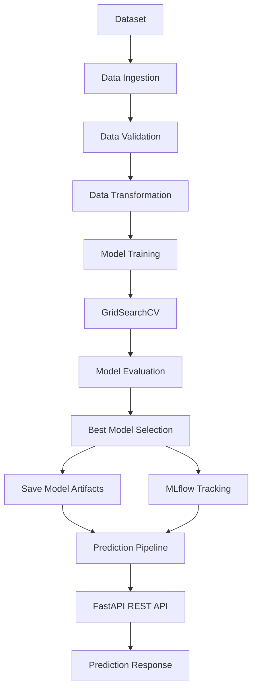

# ❤️ Heart Disease Prediction API

A production-ready Machine Learning application for heart disease prediction built with **FastAPI**, **Scikit-learn**, **UV**, **MLflow**, **Docker**, and **GitHub Actions**. The project demonstrates an end-to-end MLOps workflow, from data ingestion and model training to experiment tracking, API deployment, automated testing, and CI/CD.


# 📖 Project Overview

Heart Disease Prediction API is a production-ready Machine Learning application that predicts the likelihood of heart disease using patient clinical data. The project is designed with a modular architecture that follows industry best practices for building, training, evaluating, and deploying machine learning models.

Unlike a typical notebook-based implementation, this project provides a complete end-to-end ML workflow, including automated data ingestion, validation, preprocessing, model training, hyperparameter tuning, experiment tracking with MLflow, REST API deployment using FastAPI, containerization with Docker, and automated testing.

The project evaluates multiple classification algorithms, compares their performance using standard evaluation metrics, and automatically selects the best-performing model for deployment. Predictions are served through a FastAPI-based REST API with built-in request validation using Pydantic.

The development workflow is powered by **UV** for fast dependency management and reproducible environments, while code quality is maintained using **Ruff**, **Black**, **MyPy**, and **Pytest**. CI/CD is integrated using **GitHub Actions**, making the project suitable for both learning modern MLOps practices and serving as a production-ready template for future machine learning applications.

---


# 📚 Table of Contents

- [📖 Project Overview](#-project-overview)
- [💡 Why This Project?](#-why-this-project)
- [✨ Features](#-features)
- [🛠️ Technology Stack](#️-technology-stack)
- [🏗️ Project Architecture](#️-project-architecture)
- [🤖 Machine Learning Pipeline](#-machine-learning-pipeline)
- [📊 Dataset](#-dataset)
- [📁 Project Structure](#-project-structure)
- [🚀 Installation & Setup](#-installation--setup)
- [🌐 API Usage](#-api-usage)
- [📈 MLflow Integration](#-mlflow-integration)
- [🧪 Testing & Code Quality](#-testing--code-quality)
- [🐳 Docker Deployment](#-docker-deployment)
- [🔄 Continuous Integration (CI)](#-continuous-integration-ci)
- [🚀 Future Improvements](#-future-improvements)
- [🤝 Contributing](#-contributing)
- [📄 License](#-license)
- [👨‍💻 Author](#-author)


# ⚡ Quick Start

```bash
# Clone the repository
git clone https://github.com/Mayank1532/heart-disease-prediction.git

# Navigate to the project
cd heart-disease-prediction

# Create a virtual environment
uv venv

# Activate the virtual environment
# Windows (PowerShell)
.venv\Scripts\Activate.ps1

# Install dependencies
uv sync

# Train the model
uv run python src/pipeline/training_pipeline.py

# Start the FastAPI server
uv run uvicorn app.main:app --reload
```

Open your browser:

- **API:** http://127.0.0.1:8000
- **Swagger UI:** http://127.0.0.1:8000/docs
- **ReDoc:** http://127.0.0.1:8000/redoc
- **MLflow UI:** http://127.0.0.1:5000


## 🎯 Project Objectives

- Build a complete end-to-end Machine Learning pipeline
- Predict the likelihood of heart disease from clinical features
- Compare multiple classification algorithms
- Automatically select the best-performing model
- Track experiments using MLflow
- Expose predictions through a FastAPI REST API
- Maintain high code quality with automated testing and linting
- Simplify development using UV for dependency management
- Enable reproducible deployments using Docker and GitHub Actions

# 💡 Why This Project?

Many machine learning projects focus only on training a model inside a Jupyter Notebook. While useful for experimentation, they often lack the structure, automation, and deployment capabilities required for real-world applications.

This project was built to demonstrate how a machine learning solution can be designed as a production-ready application by combining software engineering best practices with modern MLOps workflows.

### Key Goals

- Build a modular and maintainable machine learning architecture
- Automate the complete ML workflow from data ingestion to prediction
- Compare multiple classification algorithms and select the best-performing model
- Track experiments, metrics, and model versions using MLflow
- Serve predictions through a FastAPI REST API
- Ensure reproducibility with UV-based dependency management
- Maintain code quality using automated testing, linting, formatting, and static type checking
- Enable containerized deployment with Docker
- Automate validation and testing through GitHub Actions

---

## 🌟 Highlights

✔️ End-to-End Machine Learning Pipeline

✔️ Production-Ready Project Structure

✔️ FastAPI REST API

✔️ MLflow Experiment Tracking & Model Registry

✔️ Hyperparameter Tuning with GridSearchCV

✔️ Dockerized Deployment

✔️ UV for Fast Dependency Management

✔️ Automated Testing with Pytest

✔️ Code Quality with Ruff, Black, and MyPy

✔️ CI/CD with GitHub Actions

This project serves as both a practical implementation of a heart disease prediction system and a reusable template for developing scalable machine learning applications.


# ✨ Features

The project includes a complete production-oriented Machine Learning workflow, from data ingestion to model deployment.

## 🤖 Machine Learning

- End-to-end classification pipeline
- Automated data ingestion and validation
- Data preprocessing and feature engineering
- Multiple classification algorithms
  - Logistic Regression
  - Decision Tree
  - Random Forest
  - Gradient Boosting
- Hyperparameter tuning using GridSearchCV
- Automatic best model selection
- Model serialization for inference

---

## 📊 Experiment Tracking

- MLflow experiment tracking
- Parameter logging
- Performance metric logging
- Model artifact storage
- MLflow Model Registry integration

---

## 🚀 REST API

- FastAPI-based REST API
- Interactive Swagger UI
- ReDoc documentation
- Request validation using Pydantic
- JSON prediction responses
- Health check endpoint

---

## ⚙️ MLOps & DevOps

- UV for dependency and environment management
- Docker support for containerized deployment
- GitHub Actions for Continuous Integration (CI)
- Environment-based configuration
- Structured logging
- Centralized exception handling

---

## 🧪 Testing & Code Quality

- Unit testing with Pytest
- Static analysis with Ruff
- Automatic code formatting with Black
- Static type checking with MyPy
- Modular and maintainable project architecture

---

## 📁 Project Design

- Layered architecture
- Configuration-driven workflow
- Reusable pipeline components
- Separation of training and inference logic
- Production-ready folder structure
- Easy to extend for new datasets and ML models

# 🛠️ Technology Stack

The project leverages a modern Python ecosystem for Machine Learning, API development, MLOps, testing, and deployment.

| Category | Technologies |
|----------|--------------|
| **Programming Language** | Python 3.12 |
| **Package & Environment Management** | UV |
| **Machine Learning** | Scikit-learn |
| **Data Processing** | Pandas, NumPy |
| **Model Evaluation** | GridSearchCV, Accuracy, Precision, Recall, F1-Score, ROC-AUC |
| **Experiment Tracking** | MLflow |
| **API Framework** | FastAPI |
| **Data Validation** | Pydantic |
| **ASGI Server** | Uvicorn |
| **Containerization** | Docker |
| **Testing** | Pytest |
| **Linting** | Ruff |
| **Code Formatting** | Black |
| **Static Type Checking** | MyPy |
| **Version Control** | Git & GitHub |
| **CI/CD** | GitHub Actions |

---

## 📦 Core Python Libraries

- FastAPI
- Uvicorn
- Scikit-learn
- Pandas
- NumPy
- MLflow
- Pydantic

---

## 🧰 Development Tools

- UV
- Git
- GitHub
- Docker
- GitHub Actions
- Ruff
- Black
- MyPy
- Pytest


# 🏗️ Project Architecture

The project follows a modular, layered architecture that separates data processing, model training, experiment tracking, and prediction serving into independent components. This design improves maintainability, scalability, and reusability while supporting a complete end-to-end Machine Learning workflow.



---

## 🧩 Architecture Layers

### Data Layer

Responsible for acquiring, validating, and preparing the dataset.

- Data ingestion
- Schema validation
- Missing value handling
- Feature preprocessing
- Data transformation

---

### Training Layer

Responsible for training and selecting the best-performing model.

- Multiple classification algorithms
- Hyperparameter tuning with GridSearchCV
- Model evaluation
- Automatic best model selection
- Model persistence

---

### Experiment Tracking Layer

MLflow records every training run, including:

- Parameters
- Evaluation metrics
- Trained models
- Model artifacts
- Registered model versions

---

### Inference Layer

The prediction pipeline loads the saved preprocessing pipeline and trained model to generate predictions for new patient data.

---

### API Layer

FastAPI exposes REST endpoints for model inference.

Features include:

- Request validation with Pydantic
- JSON responses
- Interactive Swagger UI
- ReDoc documentation
- Health check endpoint

---

## 📂 Architectural Principles

- Modular design
- Separation of concerns
- Configuration-driven components
- Reusable pipelines
- Production-ready project structure
- Easy extensibility for additional models and datasets


# 🤖 Machine Learning Pipeline

The project implements a complete end-to-end Machine Learning pipeline that automates every stage of the workflow, from raw data ingestion to serving predictions through a REST API.

The pipeline is modular, reusable, and designed to support reproducible model training and deployment.

---

## 1️⃣ Data Ingestion

The pipeline begins by loading the raw heart disease dataset into the project workspace.

**Responsibilities**

- Read the source dataset
- Validate file availability
- Create train/test datasets
- Store datasets in the artifacts directory

**Output**

- Training dataset
- Testing dataset

---

## 2️⃣ Data Validation

Before training, the dataset is validated to ensure data quality and consistency.

**Validation Checks**

- Required columns exist
- Expected data types
- Dataset is not empty
- Schema validation

This helps detect data issues before model training begins.

---

## 3️⃣ Data Transformation

The preprocessing pipeline prepares the data for machine learning.

Typical preprocessing includes:

- Handling categorical features
- Feature encoding
- Data preprocessing
- Feature pipeline creation

The fitted preprocessing pipeline is saved and reused during inference to ensure consistency between training and prediction.

---

## 4️⃣ Model Training

Multiple classification algorithms are trained and evaluated.

Current models include:

- Logistic Regression
- Decision Tree Classifier
- Random Forest Classifier
- Gradient Boosting Classifier

Each model is trained using the transformed dataset.

---

## 5️⃣ Hyperparameter Tuning

To improve model performance, the project performs hyperparameter optimization using **GridSearchCV**.

This process:

- Evaluates multiple parameter combinations
- Performs cross-validation
- Selects the optimal hyperparameters
- Reduces manual tuning effort

---

## 6️⃣ Model Evaluation

Each trained model is evaluated using standard classification metrics.

Evaluation metrics include:

- Accuracy
- Precision
- Recall
- F1-Score
- ROC-AUC Score

These metrics are used to compare model performance objectively.

---

## 7️⃣ Best Model Selection

After evaluation, the pipeline automatically selects the best-performing model based on the configured evaluation criteria.

The selected model is then:

- Serialized
- Saved as an artifact
- Prepared for inference

---

## 8️⃣ MLflow Tracking

Every training run is automatically tracked using MLflow.

Logged information includes:

- Model parameters
- Evaluation metrics
- Trained models
- Model artifacts
- Experiment history

This enables experiment comparison and reproducibility.

---

## 9️⃣ Prediction Pipeline

The prediction pipeline loads:

- Saved preprocessing pipeline
- Best trained model

Incoming API requests undergo the same preprocessing steps as the training data before generating predictions.

This guarantees consistent inference behavior.

---

## 🔄 End-to-End Workflow

```text
Dataset
    │
    ▼
Data Ingestion
    │
    ▼
Data Validation
    │
    ▼
Data Transformation
    │
    ▼
Model Training
    │
    ▼
GridSearchCV
    │
    ▼
Model Evaluation
    │
    ▼
Best Model Selection
    │
    ├────────► MLflow Tracking
    │
    ▼
Model Artifacts
    │
    ▼
Prediction Pipeline
    │
    ▼
FastAPI REST API
    │
    ▼
Prediction Response
```

The modular design allows each stage to be independently maintained, tested, and extended, making the pipeline suitable for both experimentation and production deployment.


# 📊 Dataset

The project uses the **Heart Disease Prediction Dataset**, which contains clinical and demographic information collected from patients. The objective is to predict whether a patient is likely to have heart disease based on medical attributes.

The dataset is intended for **binary classification**, where the target variable indicates the presence or absence of heart disease.

---

## Dataset Summary

| Property | Value |
|----------|-------|
| Problem Type | Binary Classification |
| Target Variable | `HeartDisease` |
| Number of Features | 11 |
| Input Type | Clinical Patient Data |
| Output | Heart Disease Prediction |

---

## Feature Description

| Feature | Description |
|---------|-------------|
| **Age** | Age of the patient (years) |
| **Sex** | Patient's gender (`M` = Male, `F` = Female) |
| **ChestPainType** | Type of chest pain (`ATA`, `NAP`, `ASY`, `TA`) |
| **RestingBP** | Resting blood pressure (mm Hg) |
| **Cholesterol** | Serum cholesterol (mg/dL) |
| **FastingBS** | Fasting blood sugar (`1` if > 120 mg/dL, otherwise `0`) |
| **RestingECG** | Resting electrocardiogram results |
| **MaxHR** | Maximum heart rate achieved |
| **ExerciseAngina** | Exercise-induced angina (`Y` or `N`) |
| **Oldpeak** | ST depression induced by exercise relative to rest |
| **ST_Slope** | Slope of the peak exercise ST segment |

---

## Target Variable

| Value | Meaning |
|-------|---------|
| **0** | No Heart Disease |
| **1** | Heart Disease |

---

## Sample Record

```text
Age               : 40
Sex               : M
ChestPainType     : ATA
RestingBP         : 140
Cholesterol       : 289
FastingBS         : 0
RestingECG        : Normal
MaxHR             : 172
ExerciseAngina    : N
Oldpeak           : 0.0
ST_Slope          : Up
HeartDisease      : 0
```

---

## Data Processing

Before training, the dataset passes through the project's preprocessing pipeline, which performs:

- Schema validation
- Data quality checks
- Categorical feature encoding
- Feature transformation
- Train-test splitting
- Preparation for model training

The same preprocessing pipeline is reused during inference to ensure consistent predictions for new input data.


# 📁 Project Structure

The project follows a modular and scalable directory structure that separates data processing, model training, API development, configuration, and deployment. This organization improves maintainability, readability, and extensibility.

```text
heart-disease-prediction/
│
├── app/                        # FastAPI application
│   ├── api/                    # API routes
│   ├── schemas/                # Pydantic request/response models
│   └── main.py                 # FastAPI entry point
│
├── config/                     # Configuration files
│
├── data/
│   ├── raw/                    # Original dataset
│   └── processed/              # Processed datasets (optional)
│
├── artifacts/                  # Saved models and preprocessing artifacts
│
├── docs/                       # Project documentation
│
├── logs/                       # Application and training logs
│
├── notebooks/                  # Exploratory notebooks
│
├── src/
│   ├── components/             # Data ingestion, validation, transformation, training
│   ├── config/                 # Configuration management
│   ├── constants/              # Project constants
│   ├── entity/                 # Configuration and artifact dataclasses
│   ├── exception/              # Custom exception handling
│   ├── logger/                 # Logging configuration
│   ├── pipeline/               # Training and prediction pipelines
│   └── utils/                  # Utility functions
│
├── tests/                      # Unit and integration tests
│
├── .github/
│   └── workflows/              # GitHub Actions workflows
│
├── Dockerfile                  # Docker image configuration
├── docker-compose.yml          # Multi-container configuration (if used)
├── pyproject.toml              # Project metadata and UV dependencies
├── uv.lock                     # Dependency lock file
├── README.md                   # Project documentation
└── .gitignore                  # Git ignore rules
```

---

## 📂 Directory Overview

| Directory | Purpose |
|-----------|---------|
| **app/** | FastAPI application and API endpoints |
| **config/** | Configuration files and settings |
| **data/** | Raw and processed datasets |
| **artifacts/** | Saved models, preprocessors, and training artifacts |
| **docs/** | Additional project documentation |
| **logs/** | Training and application logs |
| **notebooks/** | Exploratory Data Analysis (EDA) and experiments |
| **src/** | Core machine learning implementation |
| **tests/** | Unit and integration tests |
| **.github/workflows/** | CI/CD pipelines using GitHub Actions |

---

## 🏛️ Design Principles

The project structure is designed around the following principles:

- **Modularity** – Each component has a single responsibility.
- **Separation of Concerns** – Training, inference, API, and utilities are isolated.
- **Reusability** – Pipelines and utilities can be reused across projects.
- **Scalability** – New models, datasets, or APIs can be added with minimal changes.
- **Maintainability** – A clear directory layout makes the codebase easier to understand and extend.


# 🚀 Installation & Setup

Follow the steps below to set up the project locally.

## Prerequisites

Ensure the following tools are installed before you begin:

- Python **3.12+**
- UV
- Git
- Docker *(optional, for containerized deployment)*

---

## 1. Clone the Repository

```bash
git clone https://github.com/Mayank1532/heart-disease-prediction.git
cd heart-disease-prediction
```

---

## 2. Create the Virtual Environment

```bash
uv venv
```

Activate the virtual environment.

### Windows (PowerShell)

```powershell
.venv\Scripts\Activate.ps1
```

### Windows (Command Prompt)

```cmd
.venv\Scripts\activate.bat
```

### Linux / macOS

```bash
source .venv/bin/activate
```

---

## 3. Install Dependencies

Synchronize the project dependencies using UV.

```bash
uv sync
```

This installs all dependencies defined in `pyproject.toml` and locks them using `uv.lock`.

---

## 4. Verify the Installation

Check that the project environment is configured correctly.

```bash
uv run python --version
```

Example output:

```text
Python 3.12.x
```

---

## 5. Train the Model

Run the training pipeline to:

- Load the dataset
- Validate the data
- Transform the features
- Train multiple models
- Perform hyperparameter tuning
- Select the best model
- Save the trained artifacts
- Log experiments to MLflow

```bash
uv run python src/pipeline/training_pipeline.py
```

---

## 6. Start the FastAPI Server

Launch the API locally.

```bash
uv run uvicorn app.main:app --reload
```

The application will be available at:

```text
http://127.0.0.1:8000
```

---

## 7. API Documentation

FastAPI automatically generates interactive API documentation.

| Documentation | URL |
|--------------|-----|
| Swagger UI | http://127.0.0.1:8000/docs |
| ReDoc | http://127.0.0.1:8000/redoc |

---

## 8. Project Commands

| Task | Command |
|------|---------|
| Install dependencies | `uv sync` |
| Run training pipeline | `uv run python src/pipeline/training_pipeline.py` |
| Start FastAPI server | `uv run uvicorn app.main:app --reload` |
| Run tests | `uv run pytest` |
| Lint code | `uv run ruff check .` |
| Format code | `uv run black .` |
| Type checking | `uv run mypy .` |
| Start MLflow UI | `uv run mlflow ui` |


# 🌐 API Usage

The application exposes a RESTful API built with **FastAPI** for predicting the likelihood of heart disease based on patient clinical data.

Once the server is running, the API is available at:

```text
http://127.0.0.1:8000
```

---

## Interactive Documentation

FastAPI automatically generates interactive API documentation.

| Documentation | URL |
|--------------|-----|
| Swagger UI | http://127.0.0.1:8000/docs |
| ReDoc | http://127.0.0.1:8000/redoc |

---

## Available Endpoints

| Method | Endpoint | Description |
|---------|----------|-------------|
| GET | `/` | Welcome endpoint |
| GET | `/health` | Health check endpoint |
| POST | `/predict` | Predict heart disease |

---

# Prediction Endpoint

### Request

**POST** `/predict`

**Content-Type**

```text
application/json
```

---

### Sample Request

```json
{
    "Age": 40,
    "Sex": "M",
    "ChestPainType": "ATA",
    "RestingBP": 140,
    "Cholesterol": 289,
    "FastingBS": 0,
    "RestingECG": "Normal",
    "MaxHR": 172,
    "ExerciseAngina": "N",
    "Oldpeak": 0.0,
    "ST_Slope": "Up"
}
```

---

### Sample Response

```json
{
    "prediction": 0,
    "diagnosis": "No Heart Disease"
}
```

---

## Prediction Labels

| Prediction | Diagnosis |
|------------|-----------|
| 0 | No Heart Disease |
| 1 | Heart Disease |

---

## Example using cURL

```bash
curl -X POST "http://127.0.0.1:8000/predict" \
-H "Content-Type: application/json" \
-d '{
  "Age":40,
  "Sex":"M",
  "ChestPainType":"ATA",
  "RestingBP":140,
  "Cholesterol":289,
  "FastingBS":0,
  "RestingECG":"Normal",
  "MaxHR":172,
  "ExerciseAngina":"N",
  "Oldpeak":0.0,
  "ST_Slope":"Up"
}'
```

---

## API Workflow

The prediction request follows the workflow below:

```text
Client Request
      │
      ▼
FastAPI Endpoint
      │
      ▼
Pydantic Validation
      │
      ▼
Load Preprocessing Pipeline
      │
      ▼
Transform Input Features
      │
      ▼
Load Trained Model
      │
      ▼
Generate Prediction
      │
      ▼
Return JSON Response
```

---

## Error Handling

The API includes validation and exception handling to ensure reliable responses.

Typical validation includes:

- Missing required fields
- Invalid data types
- Invalid categorical values
- Internal server errors

Appropriate HTTP status codes and error messages are returned for invalid requests.


# 📈 MLflow Integration

This project integrates **MLflow** to track machine learning experiments, compare model performance, and manage trained models throughout the development lifecycle.

MLflow improves reproducibility by recording every training run, including the parameters, evaluation metrics, and generated model artifacts.

---

## Experiment Tracking

Each training run automatically logs:

- Model name
- Hyperparameters
- Training configuration
- Evaluation metrics
- Training artifacts

This enables easy comparison of multiple experiments and helps identify the best-performing model.

---

## Evaluation Metrics

The following classification metrics are tracked during model evaluation:

- Accuracy
- Precision
- Recall
- F1-Score
- ROC-AUC Score

These metrics provide a comprehensive view of model performance beyond overall accuracy.

---

## Logged Artifacts

MLflow stores the generated artifacts for every experiment, including:

- Trained model
- Preprocessing pipeline (if configured)
- Model signature
- Input example (if configured)

Artifact logging allows trained models to be reproduced and reused without retraining.

---

## Model Registry

The project supports the **MLflow Model Registry**, making it easier to manage trained models across different stages of the machine learning lifecycle.

The registry provides:

- Model versioning
- Centralized model management
- Easy retrieval of trained models
- Traceability across experiments

---

## MLflow Workflow

```text
Start Training
       │
       ▼
Train Multiple Models
       │
       ▼
Evaluate Models
       │
       ▼
Log Parameters
       │
       ▼
Log Metrics
       │
       ▼
Log Model Artifacts
       │
       ▼
Register Best Model
       │
       ▼
Experiment History
```

---

## Launch the MLflow UI

Start the MLflow Tracking UI locally:

```bash
uv run mlflow ui
```

The dashboard will be available at:

```text
http://127.0.0.1:5000
```

---

## Benefits of MLflow

- 📊 Experiment tracking
- 📈 Performance comparison
- 🔄 Reproducible training
- 📦 Artifact management
- 🏷️ Model versioning
- 🚀 Simplified deployment workflow


# 🧪 Testing & Code Quality

The project includes automated tests and code quality checks to ensure reliability, maintainability, and consistency throughout the development lifecycle.

---

## Running the Test Suite

Execute all tests:

```bash
uv run pytest
```

Run tests with verbose output:

```bash
uv run pytest -v
```

Run a specific test file:

```bash
uv run pytest tests/test_prediction_pipeline.py -v
```

---

## Test Coverage

The test suite validates the major components of the application, including:

- Data Ingestion
- Data Validation
- Data Transformation
- Model Training
- Prediction Pipeline
- Prediction Service
- FastAPI Endpoints
- Utility Functions

The project currently contains **28 passing automated tests**, helping ensure consistent behavior across the complete machine learning workflow.

---

## Code Quality Tools

To maintain a clean and production-ready codebase, the project uses several development tools.

### Ruff

Perform static analysis and linting:

```bash
uv run ruff check .
```

Automatically fix supported issues:

```bash
uv run ruff check . --fix
```

---

### Black

Format the project:

```bash
uv run black .
```

Verify formatting:

```bash
uv run black --check .
```

---

### MyPy

Perform static type checking:

```bash
uv run mypy .
```

---

## Recommended Development Workflow

Before pushing changes, run the following quality checks:

```bash
uv run ruff check .
uv run black --check .
uv run mypy .
uv run pytest
```

Running these commands helps ensure that the project remains:

- Well tested
- Properly formatted
- Free from common linting issues
- Type-safe
- Ready for Continuous Integration

---

## Continuous Integration

The repository includes a GitHub Actions workflow that automatically validates every push and pull request by running the project's quality checks.

Typical CI pipeline stages include:

- Installing project dependencies with UV
- Running Ruff for linting
- Verifying formatting with Black
- Running MyPy for type checking
- Executing the complete Pytest test suite

This automated validation helps maintain code quality and prevents regressions before changes are merged.


# 🐳 Docker Deployment

The project supports containerized deployment using **Docker**, allowing the application to run consistently across different environments without requiring local dependency installation.

---

## Prerequisites

Before building the Docker image, ensure Docker is installed and running.

Verify your installation:

```bash
docker --version
```

---

## Build the Docker Image

Build the Docker image from the project root directory:

```bash
docker build -t heart-disease-prediction .
```

---

## Run the Docker Container

Start the application:

```bash
docker run -d \
-p 8000:8000 \
--name heart-disease-api \
heart-disease-prediction
```

The API will be available at:

```text
http://localhost:8000
```

---

## Verify the Running Container

View running containers:

```bash
docker ps
```

Expected output:

```text
CONTAINER ID   IMAGE                      STATUS
xxxxxxxxxxxx   heart-disease-prediction   Up
```

---

## View Container Logs

```bash
docker logs heart-disease-api
```

---

## Stop the Container

```bash
docker stop heart-disease-api
```

---

## Remove the Container

```bash
docker rm heart-disease-api
```

---

## Remove the Docker Image

```bash
docker rmi heart-disease-prediction
```

---

## Using Docker Compose (Optional)

If the repository includes a `docker-compose.yml` file, start the application with:

```bash
docker compose up --build
```

Run in detached mode:

```bash
docker compose up -d --build
```

Stop the services:

```bash
docker compose down
```

---

## Dockerized Application Workflow

```text
Application Source
        │
        ▼
Docker Build
        │
        ▼
Docker Image
        │
        ▼
Docker Container
        │
        ▼
FastAPI Application
        │
        ▼
REST API
```

---

## Benefits of Docker

- Consistent execution across environments
- Isolated runtime with all required dependencies
- Simplified deployment
- Easy scaling and portability
- Faster onboarding for contributors
- Reproducible production environments


# 🔄 Continuous Integration (CI)

The project uses **GitHub Actions** to automatically validate the codebase whenever changes are pushed to the repository or submitted through a pull request.

The CI pipeline helps maintain code quality, detect issues early, and ensure that the application remains stable.

---

## Workflow Overview

The GitHub Actions workflow automatically performs the following steps:

1. Checkout the repository
2. Set up Python
3. Install UV
4. Synchronize project dependencies
5. Run code quality checks
6. Execute automated tests

This ensures that every code change is validated before being merged.

---

## CI Pipeline

```text
Push / Pull Request
        │
        ▼
Checkout Repository
        │
        ▼
Setup Python
        │
        ▼
Install UV
        │
        ▼
Synchronize Dependencies
        │
        ▼
Ruff Linting
        │
        ▼
Black Formatting Check
        │
        ▼
MyPy Type Checking
        │
        ▼
Pytest Test Suite
        │
        ▼
Workflow Status
```

---

## Automated Checks

The CI workflow performs the following validations:

| Check | Purpose |
|--------|---------|
| **Dependency Installation** | Synchronize project dependencies using UV |
| **Ruff** | Detect linting issues and code quality problems |
| **Black** | Verify consistent code formatting |
| **MyPy** | Perform static type checking |
| **Pytest** | Execute the automated test suite |

---

## Trigger Events

The workflow runs automatically on:

- Push to the repository
- Pull requests

This helps ensure that all proposed changes meet the project's quality standards before integration.

---

## Local Verification

Before pushing code, run the same checks locally:

```bash
uv sync

uv run ruff check .
uv run black --check .
uv run mypy .
uv run pytest
```

Running these commands locally reduces CI failures and helps maintain a consistent development workflow.

---

## Benefits of CI

- ✅ Automatic code validation
- ✅ Early detection of errors
- ✅ Consistent code quality
- ✅ Reliable automated testing
- ✅ Faster collaboration
- ✅ Production-ready development workflow


# 🚀 Future Improvements

Although the project provides a complete end-to-end machine learning workflow, there are several opportunities for future enhancement.

## Machine Learning

- Add support for additional classification algorithms (e.g., XGBoost, LightGBM, CatBoost)
- Implement automated feature selection techniques
- Explore ensemble and stacking methods
- Improve model explainability using SHAP or LIME
- Add support for automated retraining pipelines

---

## API & Deployment

- Add API authentication and authorization
- Implement request rate limiting
- Introduce API versioning
- Add response caching for improved performance
- Deploy the application to cloud platforms such as AWS, Azure, or Google Cloud

---

## MLOps

- Integrate DVC for dataset and model versioning
- Automate model deployment using GitHub Actions
- Add monitoring for model performance and data drift
- Implement continuous training (CT) pipelines
- Support remote MLflow tracking servers

---

## Testing & Quality

- Increase unit and integration test coverage
- Add performance and load testing
- Introduce API contract testing
- Generate automated code coverage reports
- Add security and dependency vulnerability scanning

---

## Project Enhancements

- Develop a web-based frontend dashboard
- Add batch prediction support
- Support CSV file uploads for bulk predictions
- Add prediction history and logging
- Provide multilingual API documentation
- Package the project as a reusable template for future ML applications

---

## Long-Term Vision

The long-term goal is to evolve this project from a standalone prediction service into a production-ready Machine Learning platform with automated training, deployment, monitoring, and scalable cloud infrastructure following modern MLOps best practices.


# 🤝 Contributing

Contributions are welcome! Whether you're fixing bugs, improving documentation, adding new features, or enhancing the machine learning pipeline, your contributions are greatly appreciated.

## How to Contribute

### 1. Fork the Repository

Create your own copy of the repository by clicking the **Fork** button on GitHub.

---

### 2. Clone Your Fork

```bash
git clone https://github.com/<your-username>/heart-disease-prediction.git
cd heart-disease-prediction
```

---

### 3. Create a Virtual Environment

```bash
uv venv
```

Activate the virtual environment.

---

### 4. Install Dependencies

```bash
uv sync
```

---

### 5. Create a Feature Branch

```bash
git checkout -b feature/your-feature-name
```

Use descriptive branch names, for example:

- `feature/add-xgboost`
- `feature/improve-api`
- `fix/data-validation`
- `docs/readme-update`

---

### 6. Make Your Changes

Please follow the project's coding standards and keep changes focused on a single feature or fix.

---

### 7. Run Quality Checks

Before committing your changes, verify that everything passes successfully.

```bash
uv run ruff check .
uv run black --check .
uv run mypy .
uv run pytest
```

---

### 8. Commit Your Changes

Write clear and descriptive commit messages.

Example:

```bash
git commit -m "feat: add XGBoost classifier"
```

---

### 9. Push Your Branch

```bash
git push origin feature/your-feature-name
```

---

### 10. Open a Pull Request

Create a Pull Request on GitHub with:

- A clear description of your changes
- The motivation behind the change
- Any relevant screenshots or logs (if applicable)

---

## Contribution Guidelines

Please ensure that your contribution:

- Follows the existing project structure
- Includes appropriate documentation updates
- Passes all automated quality checks
- Maintains code readability and consistency
- Includes tests for new functionality whenever applicable

---

## Reporting Issues

If you encounter a bug or have a feature request, please open a GitHub Issue and include:

- A clear description
- Steps to reproduce (if applicable)
- Expected behavior
- Actual behavior
- Environment details (Python version, operating system, etc.)

---

## Code of Conduct

Please be respectful and constructive in all interactions. We aim to maintain a welcoming and collaborative environment for everyone.


# 📄 License

This project is licensed under the **MIT License**.

The MIT License is a permissive open-source license that allows anyone to use, modify, distribute, and sublicense the software, provided that the original copyright and license notice are included.

For more information, see the [LICENSE](LICENSE) file included in this repository.

---

## License Summary

You are free to:

- ✅ Use the project for personal or commercial purposes
- ✅ Modify and improve the source code
- ✅ Distribute copies of the software
- ✅ Include the project in other software

Under the following condition:

- Include the original copyright notice and license in any copies or substantial portions of the software.

---

© 2026 Mayank Dhillon. All rights reserved.


# 👨‍💻 Author

Developed and maintained by **Mayank Dhillon**.

I'm passionate about **Machine Learning, MLOps, Data Science, and Backend Development**, with a focus on building scalable, production-ready AI applications using modern Python tools and best engineering practices.

## Connect With Me

- **GitHub:** https://github.com/Mayank1532
- **LinkedIn:** *Add your LinkedIn profile here*
- **Email:** *Add your professional email here*

---

## ⭐ Support the Project

If you found this project useful or learned something from it:

- ⭐ Star this repository
- 🍴 Fork the project
- 🛠️ Contribute through Pull Requests
- 🐛 Report bugs or suggest new features by opening an Issue

Your support helps improve the project and encourages future open-source development.

---

**Thank you for visiting this repository! Happy Coding! 🚀**

